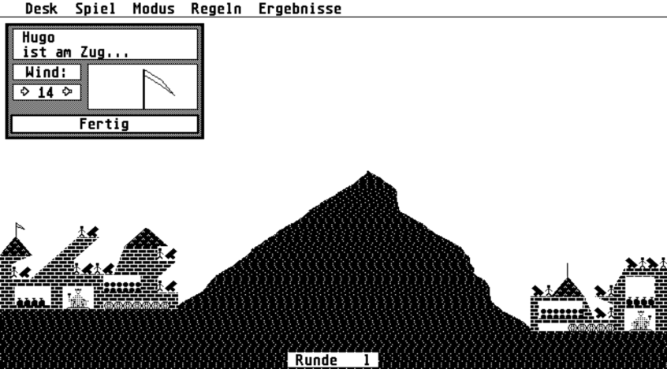

# Ballerburg
## Ballerburg - Zwei Spieler, zwei Burgen und ein Berg dazwischen...

Dieses Spiel wurde im April 1987 für den Atari ST entwickelt. Im Jahr 2013 habe ich es auf Windows 8 portiert. Die Idee dahinter war, den C-Source-Code möglichst 1:1 übernehmen zu können und es möglichst authentisch nachzubauen. Dazu habe ich die Atari-Spezifischen Funktionen nachprogrammiert.
## Links
[Ballerburg - das Original](https://www.eckhardkruse.net/atari_st/baller.html)

[Ballerburg retro im Windows Store](https://www.microsoft.com/de-ch/store/p/ballerburg-retro/9wzdncrdkm7s)

[Ballerburg pro im Windows Store](https://www.microsoft.com/de-ch/store/p/ballerburg-pro/9wzdncrdkm7t)
